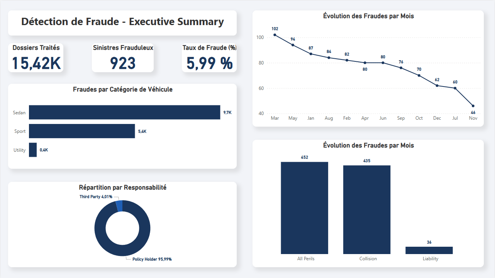

# 🚗 Détection de Fraude à l'Assurance Auto (End-to-End Project)

## 📌 Contexte du Projet
Dans le secteur de l'assurance, la détection des fausses déclarations est un enjeu financier majeur. Fort de mon expérience chez **SwissLife** en tant que contrôleur technique data, j'ai conçu ce projet analytique de bout en bout pour identifier les "patterns" de fraude et automatiser leur détection via l'Intelligence Artificielle.

**Objectif Business :** Maximiser la détection des fraudeurs (Recall) tout en minimisant l'impact sur le service de contrôle technique.

## 🏗️ Architecture du Projet
Le projet est divisé en 4 grandes étapes techniques, consultables dans les dossiers associés :

1. **Extraction & Requêtage (SQL) :** Création d'une base de données locale (`SQLite`) et requêtes analytiques sur les profils des conducteurs et les types de contrats.
2. **Exploration & Dataviz (Python / EDA) :** Analyse bivariée et multivariée (Matrice de corrélation) avec `Pandas`, `Matplotlib` et `Seaborn`.
3. **Machine Learning (Scikit-Learn) :** Entraînement de modèles de classification pour prédire la fraude.
4. **Dashboard Business (PowerBI) :** Restitution visuelle pour le top management.

## 🚀 Résultats de la Modélisation (Machine Learning)

Le principal défi de ce projet était le **déséquilibre extrême des classes** (94 % de dossiers légitimes, 6 % de fraudes). 

* **Baseline (Random Forest standard) :** Incapacité à détecter les fraudes (Recall = 0%). L'algorithme se contentait de prédire "Non-Fraude" par défaut.
* **Optimisation Technique (SMOTE) :** Génération de données synthétiques pour rééquilibrer la base d'entraînement (50/50), forçant le modèle à apprendre les caractéristiques des fraudeurs.
* **Optimisation Métier (Threshold Tuning) :** Abaissement du seuil d'alerte à 15 % de probabilité pour s'aligner sur la réalité du métier d'assureur.

### 📊 Performance Finale
Grâce à l'ajustement du seuil de décision, le modèle agit désormais comme un filtre intelligent :
- **Taux de détection (Recall Fraude) :** **95 %** (174 fraudeurs identifiés sur 184).
- **Impact Métier :** Le modèle écarte automatiquement la majorité des dossiers sains et n'envoie qu'une liste ciblée de dossiers suspects au département de contrôle, évitant des millions d'euros de remboursements illicites.

## 📂 Structure du Repository
- `/data` : Données brutes (ignorées sur Git).
- `/sql` : Scripts d'extraction et d'analyse.
- `/notebooks` : 
  - `02_EDA_Dataviz.ipynb` : Data Cleaning & Analyse Exploratoire.
  - `03_Machine_Learning.ipynb` : Modélisation Random Forest & SMOTE.
- `/dashboard` : Livrables PowerBI.

## 📊 Tableau de Bord Exécutif (Power BI)
Afin de rendre les résultats de l'algorithme accessibles au Top Management et aux parties prenantes non techniques, un dashboard "Executive Summary" a été conçu sur Power BI. 

**Fonctionnalités clés :**
* Indicateurs de performance globaux (KPIs) : Total des dossiers, Nombre de sinistres frauduleux, Taux de fraude moyen.
* Profilage métier : Répartition de la fraude par catégorie de véhicule et par responsabilité lors du sinistre.
* Analyse de la saisonnalité : Évolution temporelle des cas de fraude mois par mois.

* 📄 [Consulter la version PDF statique](dashboard/insurance_fraud_dashboard.pdf)
* 🛠️ [Télécharger le fichier interactif .pbix (Power BI Desktop)](dashboard/insurance_fraud_dashboard.pbix)

---
*👤 Projet réalisé par **Ilyes H** | Data Analyst Junior | Disponible immédiatement.*